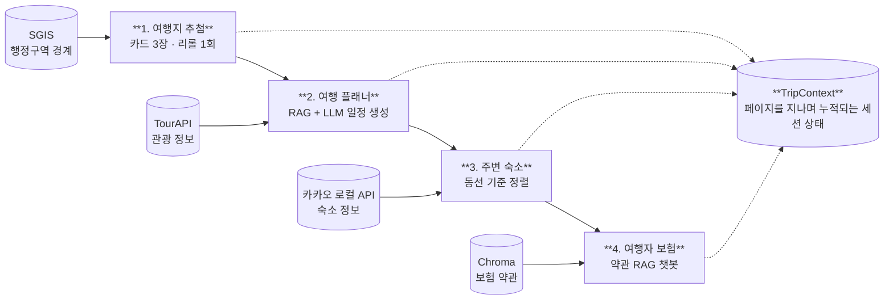

# TripRoll

> **어디로 갈지 못 정하는 사람을 위한 국내 여행 올인원 서비스**
> 여행지 뽑기 → 일정 짜기 → 숙소 고르기 → 보험 가입까지, 한 흐름으로.

Streamlit 기반 4페이지 웹 서비스. 여행 플래너와 보험 챗봇에 RAG를 적용했습니다.


---

## 왜 만들었나

여행 준비에서 사람들이 가장 많이 이탈하는 지점은 **"어디로 갈지 정하는 단계"** 입니다.
선택지가 많을수록 결정을 미루게 되기 때문입니다.

그래서 TripRoll은 반대로 갑니다.

- **선택지를 3개로 줄입니다.** 전국에서 무작위로 뽑은 카드 3장만 보여줍니다.
- **그다음을 자동으로 이어줍니다.** 지역이 정해지면 일정 → 숙소 → 보험이 알아서 따라옵니다.
- **AI가 지어내지 않습니다.** 실제 존재하는 장소와 실제 약관 조항만 근거로 씁니다.

---

## 서비스 흐름



4개 페이지는 독립 기능이 아니라 **하나의 퍼널**입니다.
앞 페이지의 결과가 뒤 페이지의 입력이 되고, 모든 상태는 `TripContext` 하나에 누적됩니다.

> P1에서 확정된 지역은 이후 페이지에서 **수정할 수 없습니다.** (`region.locked = true`)

---

## 4개 페이지

| | 페이지 | 하는 일 | 핵심 |
|---|---|---|---|
| 1 | **여행지 추첨** | 무작위 지역 3곳을 카드로 제시 | 카드팩 개봉 연출 · 카드당 리롤 1회 |
| 2 | **여행 플래너** | 조건 입력 → 날짜별 일정 자동 생성 | TourAPI 검색 후 LLM이 동선만 구성 |
| 3 | **주변 숙소** | 조건에 맞는 숙소 필터링·정렬 | 가격·별점뿐 아니라 **내 동선과의 거리**로 정렬 |
| 4 | **여행자 보험** | 보험료 산정 + 약관 질의응답 | 4개사 약관 RAG · 가입자 모드 / 비교 모드 |

<details>
<summary>페이지별 상세 보기</summary>

**1. 여행지 추첨**
- 통계청 SGIS 시군구 경계에서 무작위 좌표 추출
- 카드 3장을 터치해 오픈, 마음에 안 들면 카드당 1회 리롤
- 출발지 거리 상한 / 바다 인접 지역만 / 광역시 제외 필터


TripRoll — P1 여행지 추첨
실행
bash
python -m venv .venv
.venv\Scripts\activate          # Mac/Linux: source .venv/bin/activate
pip install -r requirements.txt
streamlit run app.py

app.py가 진입점입니다. 개별 페이지 파일을 직접 실행하지 마세요.

폴더 구조
triproll/
├── app.py                    # 진입점 · 사이드바 네비게이션 · 공통 스타일
├── views/
│   ├── _common.py            # 페이지 공용 도구 (헤더 · 상태 확인 · 안내판)
│   ├── page1_pick.py         # P1 여행지 추첨  ← 완성
│   ├── page2_planner.py      # P2 여행 플래너  (자리만)
│   ├── page3_lodging.py      # P3 주변 숙소    (자리만)
│   └── page4_insurance.py    # P4 여행자 보험  (자리만)
├── services/
│   └── geo.py                # 지역 로드 · 거리 · 필터 · 무작위 좌표
├── data/
│   └── sigungu.csv           # 시군구 161곳
├── .streamlit/config.toml    # 다크 테마
└── requirements.txt
팀원에게

각 페이지 파일에 담당 축과 할 일 목록이 적혀 있습니다. todo_panel(...) 부분을 지우고 실제 화면을 채우면 됩니다.

주고받는 값은 st.session_state.trip_context 하나입니다.

python
# P1이 채우는 값
trip_context["region"] = {
    "sido": "충청남도", "sigungu": "부여군", "name": "충남 부여군",
    "latitude": 36.27521, "longitude": 126.8811,
    "distance_km": 158, "locked": True,
}
trip_context["origin"] = {"name": "대구", "latitude": 35.872, "longitude": 128.601}

# 각자 채울 값
trip_context["plan"]      = {...}   # P2 → P3가 동선 정렬에 사용
trip_context["lodging"]   = {...}   # P3
trip_context["insurance"] = {...}   # P4

페이지 상단에서 require_region()을 부르면 여행지 확정 여부를 자동으로 확인해 줍니다.

SGIS 실제 경계 붙이기

지금은 대표 좌표 주변에서 좌표를 뽑습니다. 실제 시군구 경계 안에서 뽑으려면 GeoJSON을 아래 경로에 넣기만 하면 됩니다. 코드 수정은 필요 없습니다.

data/sgis/sigungu.geojson
출처: 통계청 SGIS (공공누리 1유형) 또는 vuski/admdongkor (CC BY 4.0)
속성에 SIG_KOR_NM(시군구명)이 있어야 자동 인식됩니다.
파일이 있으면 point-in-polygon 방식으로 전환됩니다.
뽑는 방식 두 가지

조건 패널 아래 세그먼트로 고릅니다. 어느 쪽으로 정하든 결과는 같은 자리에 기록됩니다.

모드	방식	다시 하기
카드 뽑기	무작위 3곳을 카드로 받아 하나 선택	카드당 1회
다트 던지기	전국 지도에 다트가 꽂힌 곳으로 결정	전체 1회

다트 지도는 별도 지도 파일 없이 시군구 161곳의 위경도를 점으로 찍어 그립니다. 밝은 점이 조건을 통과한 후보, 어두운 점이 걸러진 지역입니다.

두 모드는 세션 상태를 따로 씁니다(cards / dart). 모드를 오가도 각자 상태가 남고, 확정 결과만 confirmed 한 곳에 모입니다.

카드 등급

등급은 장식이 아니라 출발지에서의 거리입니다.

등급	거리	색
가벼움	~100km	회색
괜찮음	~200km	청록
본격적	~320km	보라
대장정	320km~	금색


**2. 여행 플래너**
- 입력: 인원 · 관계 · 날짜 · 출발지 · 예산 · 이동수단 · 취향
- 관계별 키워드 확장 (연인 → 카페·야경·포토스팟)
- 임베딩 유사도 × 0.85 + 키워드 일치도 × 0.15로 상위 12개 후보 선별
- strict JSON Schema + Pydantic 이중 검증
- `검색 근거 보기`로 어떤 장소를 참고했는지 확인 가능
- 결과를 JSON으로 다운로드

**3. 주변 숙소**
- 카카오 로컬 API로 숙소 조회, TourAPI 숙박정보로 보강
- 인원 · 날짜 · 유형 · 가격대 · 편의시설 필터
- P2 일정의 중심점 기준 거리 계산 후 정렬
- 가격·평점은 시연용 시뮬레이션 데이터

**4. 여행자 보험**
- 국내여행보험 4개사(메리츠·현대·삼성·DB) 약관을 Chroma에 색인
- **가입자 모드** — 내 보험사만 필터링해서 "제○조에 따르면…" 형식으로 답변
- **비교 모드** — 4개사에서 균등 검색해 상황별 보장 내용을 나란히 비교
- 보장 여부를 단정하지 않고 반드시 보험사 확인을 권고

</details>

---

## 핵심 설계 — 검색과 생성의 분리

LLM에게 그냥 물어보면 존재하지 않는 장소나 없는 약관 조항을 지어냅니다.
그래서 **찾는 일과 쓰는 일을 분리**했습니다.

```
1. 검색   실제 데이터에서 후보를 먼저 찾는다     (TourAPI / 약관 Chroma)
2. 선별   조건에 맞는 상위 후보만 추린다          (임베딩 유사도 + 키워드)
3. 생성   LLM은 그 후보 안에서만 구성한다         (Qwen3-32B)
4. 검증   스키마에 맞는지 다시 확인한다           (JSON Schema + Pydantic)
```

LLM은 **후보 목록 밖의 내용을 만들 수 없습니다.** P2 플래너와 P4 챗봇이 같은 구조를 공유합니다.

---

## 기술 스택

| 구분 | 사용 기술 |
|---|---|
| Frontend | Streamlit, Folium |
| Backend | Python 3.11, FastAPI, Pydantic |
| AI · RAG | Qwen3-32B, multilingual-e5-small, bge-m3, Chroma |
| Data | TourAPI(KorService2), 카카오 로컬 API, 통계청 SGIS |
| Infra | Docker Compose, PostgreSQL, 클라우드 배포 |

---

## 역할 분담

4인 팀. **페이지 단위가 아닌 기능 축 단위**로 나눴습니다.
페이지로 나누면 앞 페이지가 끝날 때까지 뒷 사람이 대기해야 하기 때문입니다.

| 축 | 담당 업무 | 산출물 |
|---|---|---|
| **김용주 | 데이터·인프라** | SGIS 경계 데이터 가공, TourAPI 수집기, DB 스키마, 벡터DB 구축, 클라우드 배포 | 다른 팀원들이 쓸 데이터·환경 |
| **김창조 | AI·RAG** | P2 플래너 RAG + P4 약관 RAG (둘 다 RAG라 파이프라인 재사용됨), 프롬프트, 평가 | LLM 응답 API |
| **김민성 |  백엔드** | TripContext 세션 관리, 숙소 필터·정렬, 보험료 계산, 인증 | REST API |
| **현가은 | 프론트** | 4페이지 UI, 다트 인터랙션, 지도, 챗봇 위젯 | 화면 전체 |

**진행 순서**
`스펙 확정(전원)` → `병렬 개발(축별)` → `통합(전원)` → `배포·발표(전원)`

첫 주에 `TripContext` 스키마와 Docker 세팅을 먼저 끝내야 병렬 개발이 가능합니다.

---

## 실행 방법

```bash
git clone <repository-url>
cd triproll
cp .env.example .env    # API 키 입력
docker compose up --build
```

브라우저에서 `http://localhost:8501` 접속.

**필요한 키 3개**

| 키 | 발급처 |
|---|---|
| `TOUR_API_KEY` | [공공데이터포털](https://www.data.go.kr/data/15101578/openapi.do) — 승인에 시간이 걸리니 가장 먼저 신청 |
| `KAKAO_REST_API_KEY` | 카카오 개발자센터 |
| `HF_TOKEN` | Hugging Face Access Tokens |

---

## 추후 발전 방향 — 에이전틱 AI로

지금은 **정해진 순서대로 도는 파이프라인**입니다. 사용자가 페이지를 순서대로 따라가야 하고, AI는 지정된 자리에서만 일합니다.

다음 단계는 **4개 페이지 전체를 LLM 에이전트가 직접 운영하는 구조**입니다.

| 단계 | 목표 |
|---|---|
| **1** | 페이지별 기능을 도구(tool)로 노출하고 각 페이지에 에이전트 배치 |
| **2** | 오케스트레이터가 페이지 순서를 스스로 결정 |
| **3** | 날씨·축제 취소·숙소 매진 등 변화를 감지해 계획 자동 수정 |
| **4** | 과거 여행 이력과 피드백을 기억해 개인화 |

목표는 이 한 문장이 그대로 동작하는 것입니다.

> "9월 둘째 주에 2박 3일, 예산 1인 30만 원. 알아서 다 짜줘."

여행지 추첨부터 보험까지 에이전트가 알아서 수행하고, 사용자는 중간 결과를 승인하거나 고치기만 합니다.
단, **보험 가입이나 결제처럼 되돌릴 수 없는 행동은 반드시 사용자 승인**을 거칩니다.

---

## 면책

- 여행 일정·숙소 정보·보험료는 **참고용**이며 실제 예약이나 계약을 대체하지 않습니다.
- 보험료는 공개 요율표 기반 **시뮬레이션**이고, 챗봇 답변은 법적 효력이 없습니다. 정확한 보장 여부는 보험사에 확인하세요.
- 숙소 가격·평점은 시연용 데이터입니다.

---

**데이터 출처** · 통계청 SGIS(공공누리 1유형) · 한국관광공사 TourAPI · 카카오 로컬 API